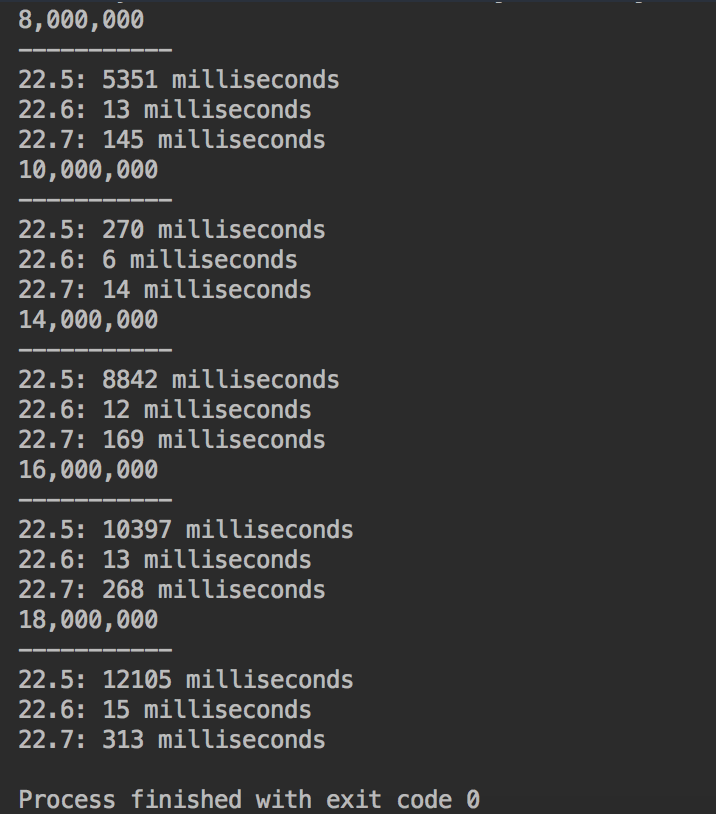

# Execution Time 22.14

This project compares the time it takes for 3 different algorithms to find all the prime numbers (n). (n) being 8, 10, 14, 16, and 18
million.

## Example Output

## Analysis Steps

I decided to put the 3 different listings in 3 different classes. I put the code into a method called returnPrime, which took in
a long (n). When the method is invoked, it finds the beginning and end time and subtracts the start time from the end time to
get how long it took in milliseconds.

### Design

I used classes because I could create 3 class objects and give it whatever parameter I wanted for (n).

## Notes

My issue was that I couldn't put prime.returnPrime into a print line, so I decided against a table. I believe my output is fine, but
I was spending more time trying to format the output than I was typing the actual code.

