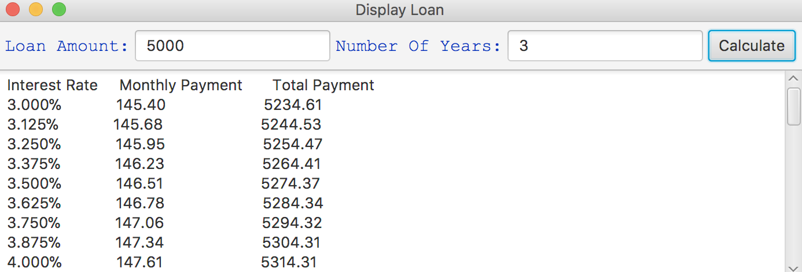

# Project Title

Project that calculates interest rate after a specified amount of time, at different interest rates.

## Example Output

### Design

I explored some different areas in javafx, such as the button shadow.

## Do not change content below this line
## Adapted from a README Built With

* [Dropwizard](http://www.dropwizard.io/1.0.2/docs/) - The web framework used
* [Maven](https://maven.apache.org/) - Dependency Management
* [ROME](https://rometools.github.io/rome/) - Used to generate RSS Feeds

## Authors

* **Ethan Treece** - *Initial work* - [PurpleBooth](https://github.com/PurpleBooth)
