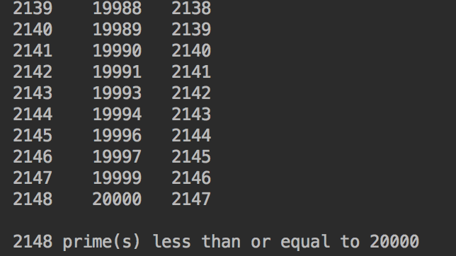

#Prime Numbers up to (n)

This program finds all prime numbers up to (n). N being whatever you set N to be. In this case, I set it equal to 20,000 for simplicity and efficiency.

This project took a lot of what we did in the project 22.14, used an algorithm to find prime numbers. This project we stored them into a .dat binary file.

##Design

I'm not going to lie, this project was quite difficult. Luckily, with the videos on 22.08 on youtube, I was able to analyze the code and understand
what was going on. Over the summer I plan on taking a Data Structures course on Udemy so I can get an even deeper understanding on algorithms.

##Testing

Most of the testing was to see how long it would take my computer to find prime numbers. I started out with the default 10,000,000 and went down from there.

##Notes

Over the summer I plan on taking a Data Structures course on Udemy so I can get an even deeper understanding on algorithms.

