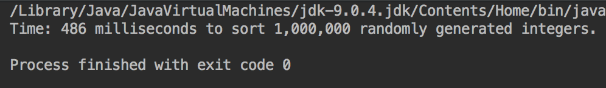

# Radix Sort

This project randomly generates 1,000,000 random numbers and loads them into in array. 
Using the Radix sort, it sorts the integers.

## Example Output




## Analysis Steps

After implementing the Radix sort, I just had to create an array list and load it with
random integers. I put the radix sort into it's own method that took in an array and 
the max amount of numbers possible. 

### Design

I used the main method to generate the numbers, load the array, create start and end time, and print the result.
I used 2 other methods as well, one for the time and one for the Radix sort.
```
for (int i = 0; i < list.length; i++)
  {
    list[i] = (int) (Math.random() * number);
  }
```
```
static long time(long start, long end){}
```
```
static void radixSort(int[] list, int maxNumber){}
```


## Testing
Testing was seeing how fast my computer could compute the program. The fastest time I had was 440ms.


## Adapted from a README Built With

* [Dropwizard](http://www.dropwizard.io/1.0.2/docs/) - The web framework used
* [Maven](https://maven.apache.org/) - Dependency Management
* [ROME](https://rometools.github.io/rome/) - Used to generate RSS Feeds

## Contributing

Please read [CONTRIBUTING.md](https://gist.github.com/PurpleBooth/b24679402957c63ec426) for details on our code of conduct, and the process for submitting pull requests to us.

## Versioning

We use [SemVer](http://semver.org/) for versioning. For the versions available, see the [tags on this repository](https://github.com/your/project/tags). 

## Authors

* **Billie Thompson** - *Initial work* - [PurpleBooth](https://github.com/PurpleBooth)

See also the list of [contributors](https://github.com/your/project/contributors) who participated in this project.

## License

This project is licensed under the MIT License - see the [LICENSE.md](LICENSE.md) file for details


