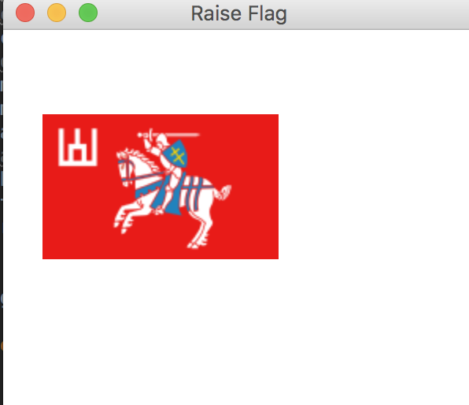

# Raise Flag

This program raises a flag using java fx.

## Example Output

## Analysis Steps

I took the listing from chapter 15 and added it to my project. I'm not quite sure if I was supposed to have 2 flags or not, but I do have
a flag that raises!

### Design

Design was easy. I just found a medieval flag and used that as my flag. Then I added a path transition and
assigned that to the flag.  

### Testing

First was finding the listing. I found that, then decided to see if i could use some of 
the code from the flashing text program we did in class. I couldn't figure it out in time so 
I had to make do with what I had. 

I tested a couple different ways of doing it, but decided on using the path transition 
because it was the easiest.

## Notes

N/A

## Adapted from a README Built With

* [Dropwizard](http://www.dropwizard.io/1.0.2/docs/) - The web framework used
* [Maven](https://maven.apache.org/) - Dependency Management
* [ROME](https://rometools.github.io/rome/) - Used to generate RSS Feeds

## Contributing

Please read [CONTRIBUTING.md](https://gist.github.com/PurpleBooth/b24679402957c63ec426) for details on our code of conduct, and the process for submitting pull requests to us.

## Versioning

We use [SemVer](http://semver.org/) for versioning. For the versions available, see the [tags on this repository](https://github.com/your/project/tags). 

## Authors

* **Billie Thompson** - *Initial work* - [PurpleBooth](https://github.com/PurpleBooth)

See also the list of [contributors](https://github.com/your/project/contributors) who participated in this project.

## License

This project is licensed under the MIT License - see the [LICENSE.md](LICENSE.md) file for details

## Acknowledgments

Renee Riley - Teacher.
